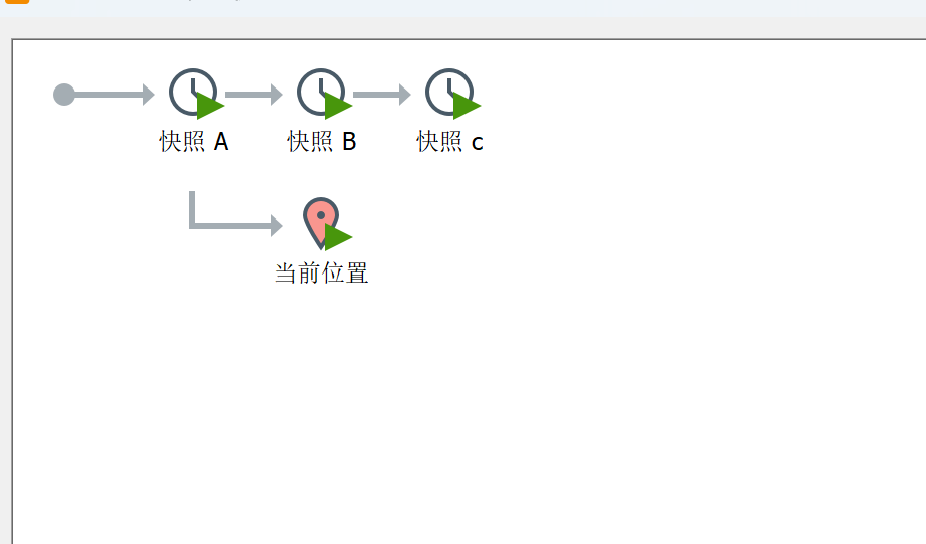

# 虚拟机快照
## 快照概念
如果你在使用虚拟机系统时（如Linux），想回到原先的某一个状态；也就是说担心可能有些误操作造成系统异常，需要回到某个正常运行状态，VMware提供了这项功能，叫做快照管理。

## 快照

可以随时回退到任意一个已保存的快照节点

## 快照操作路径
右键虚拟机 → 快照 → 拍摄快照

# 虚拟机迁移删除
## 迁移
把安装好的虚拟系统整个文件夹拷贝到别的位置使用。

## 删除
用 VMware 软件内进行删除，右键菜单→从磁盘删除（手动删除对应文件地址）